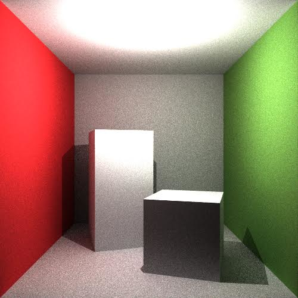
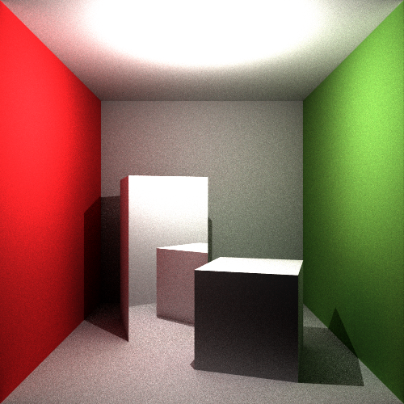
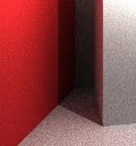
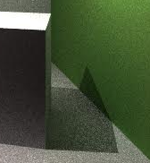
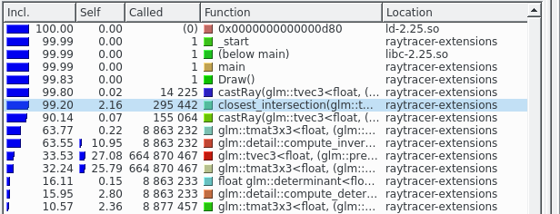
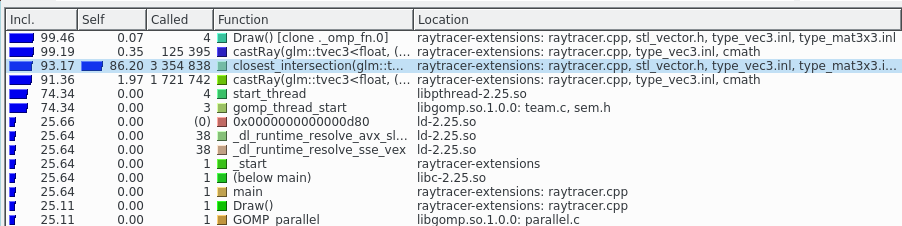
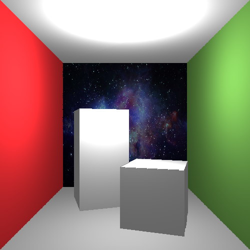
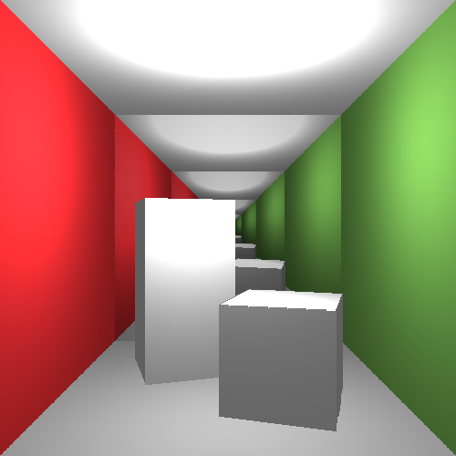

# Raytracer

{#raytracer-pathtracing-mirror width=45%}
{#raytracer-pathtracing width=45%}

Raytracer renderings

## Path tracing

We implement *global illumination* by path tracing, multiple rays are shot out of the camera through each pixel
extending it with **Markov
Chain light bouncing**, where, at each potential bounce there is a certain probability
of halting the bounces. We also have a maximum number of bounces allowed to
limit the runtime of the rendering. We also added **Monte Carlo sampling**, where
we shot several rays from the camera through each pixel at random directions to
reduce *aliasing* in the image.

Path tracing facilitates *colour bleeding* as can be seen in
[@fig:raytracer:colorbleeding]. One of the disadvantages of using path tracing
is the large number of samples required to produce noise free renders, one can
see the progressive noise reduction of each successive iteration in
[@fig:raytracer:noise-reduction].

{ width=30% }
{ width=30% }

Colour bleeding crops

## Mirrors
We implemented mirrors, where it is possible to set zero or more triangles as
perfect mirrors. We added a threshold for the maximum number of bounces on
mirrors to prevent getting into an infinite loop if there are a lot of mirrors.

## Parallelisation
We profile the raytracer under cachegrind, a sampling profiler part of the
valgrind project. The samples collected were visualised using KCacheGrind for
graphical analysis, screenshots of the tool pre and post parallelisation and
optimisation can be seen in [@fig:kcache-grind]

{ width=50% }

{ width=70% }

We **parallelise** the path tracing loop over each pixel using **OpenMP**. This
gives about a 2--3 factor speedup on a dual core machine with hyper threading.

# Rasteriser

## Controls
Mouse control stuff

## Clipping
We implement clipping and culling to reduce rendering times by removing
triangles outside of the view frustrum (culling) and straddling the frustrum
(clipping). This is performed by converting the following pipeline process:

* Convert world coordinates into homogenous coordinates
* Applying the camera transform to move the vertices into the camera coordinates frame.
* Squash the view frustrum into a cube by application of the clip space
  transform encoding perspective into the $w$ coordinate
* Clip the edges of the polygons crossing the planes defining the cube in clip
  space ($w = D$, $w = -D$, etc for each dimension $D$ of $x$, $y$, $z$), we
  also clip against the $w = 0$ plane to ensure that we don't get infinitely
  long non-contiguous lines in normalised device coordinate (NDC) space and to
  avoid division by zero errors.
* The vertices defining the clipped polygon are transformed into NDC space (a
  cube containing the world with bounds [-1, 1] in all dimensions) using the
  perspective divide.

The actual clipping algorithm is that proposed by Ken Joy, it utilises the
insight that the side of a plane a point lies on can be determined by the
definition of the plane and the point. The plane is defined to have normal
$\bm{n}$ with a point $P$ lying on the plane, we wish to determine with side a
point $Q$ lies on, to do construct a vector from $P$ to $Q$ and use the
definition of the dot product to determine whether the point $Q$ is on the same
side the normal $\bm{n}$ is facing, or on the opposing side. We can determine
the angle between the vector from $P$ to $Q$ and the normal $\bm{n}$ by $\theta
= \frac{\bm{a} \cdot \bm{b}}{|\bm{a}||\bm{b}}|$ since $\bm{a} \cdot
\bm{b} = |\bm{a}||\bm{b}|\cos(\theta)$. We now can classify the point $Q$ as
'in' if $\theta > 0$, 'on' if $\theta = 0$ and 'out' if $\theta < 0$, the
terminology of the side of the plane the point lies ('in', 'on') is chosen as we
define normals of the bounding planes to point into our world, and so a point
that is 'in' is inside the bounding plane and should not be clipped.

The plane 'in'/'out' test is utilised in an algorithm used to clip a polygon,
the polygon is clipped against each plane in turn. We give an example clipping
against the bounding plane $w = x$ which corresponds to bounding plane $x = 1$
in NDC space. For each vertex $v$ we determine whether $v$ is 'in' or 'out', we
keep track of the dot product between the vector from the surface to $v$ with the
normal of the plane that tells us this (negative implies 'out' and positive
implies 'in') for both the current vertex and the previous vertex. We then
compute the product of the previous dot product with the current dot product, if
the result is negative then either the previous vertex was out and the current
in or vica versa and so we compute the intersection of the line with the
bounding plane. We add the intersection point to an 'in' list which will form
the vertex definition of our clipped polygon. Finally we add the vertex $v$ to
the in list if the current dot product is greater than 0, i.e. if it is in.

## Textures
We implemented simple texture mapping. It loads a BMP image file and allows any
triangles to contain all or part of the image.

{ #fig:rasteriser:texture:space width=45% }
{ #fig:rasteriser:texture:infinity-mirror width=45% }

Rasteriser renderings

